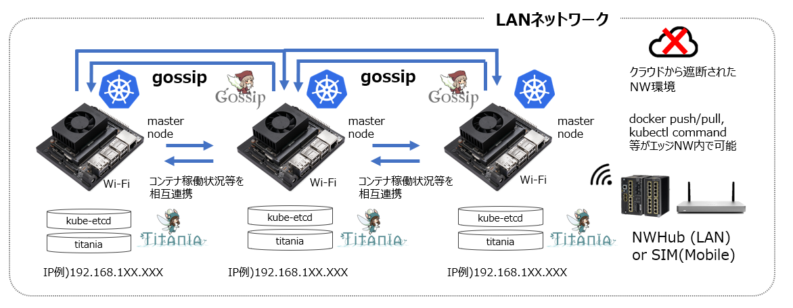

# gossip-propagation-d  
## 概要
gossip-propagation-d は、同一ネットワークに接続された複数端末間でクラスターを形成します。クラスター内の端末間で、エッジ端末情報(デバイス名、IPアドレス、死活等)や、podの起動情報を取得・同期します。また、同期されたデータは、titaniadb-sentinelによって、titaniadb に書き込まれます。gossip-propagation-d は、コンテナ上で稼働せず、OSレイヤーで稼働します。  

 

## 依存関係

- distributed-service-discovery
- titaniadb-sentinel  

## セットアップ方法
```
$ git clone git@bitbucket.org:latonaio/gossip-propagation-d.git -b v0.9.2 && cd gossip-propagation-d
$ make install
```

## 起動方法
### systemd 経由の起動
```
$ sudo systemctl start gossip-propagation-d.service
```

### マニュアルでの起動
```
$ gossip -j
```